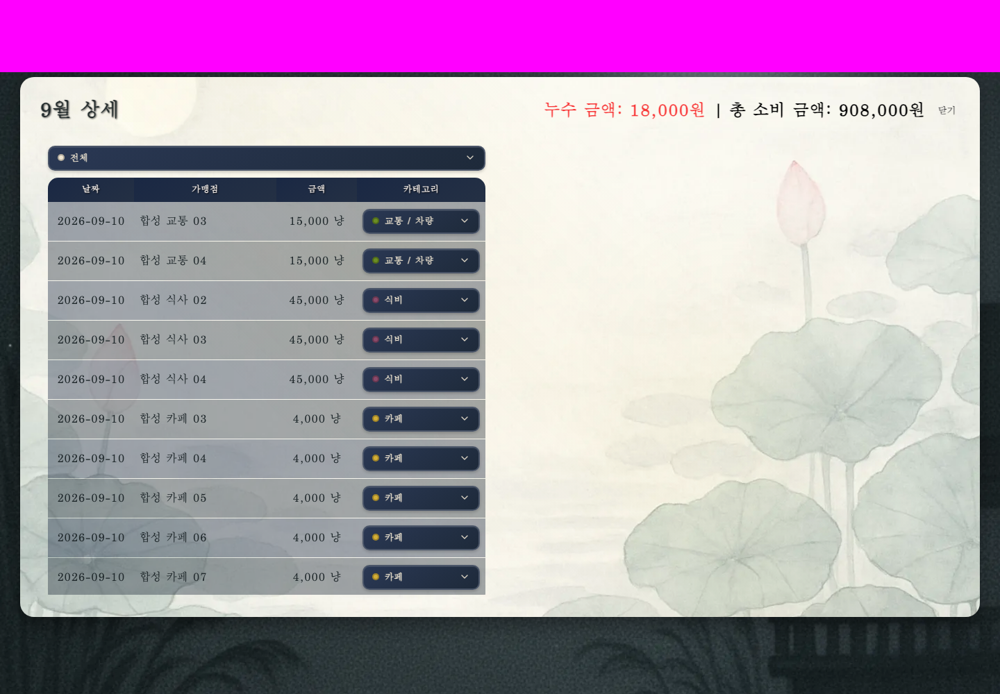
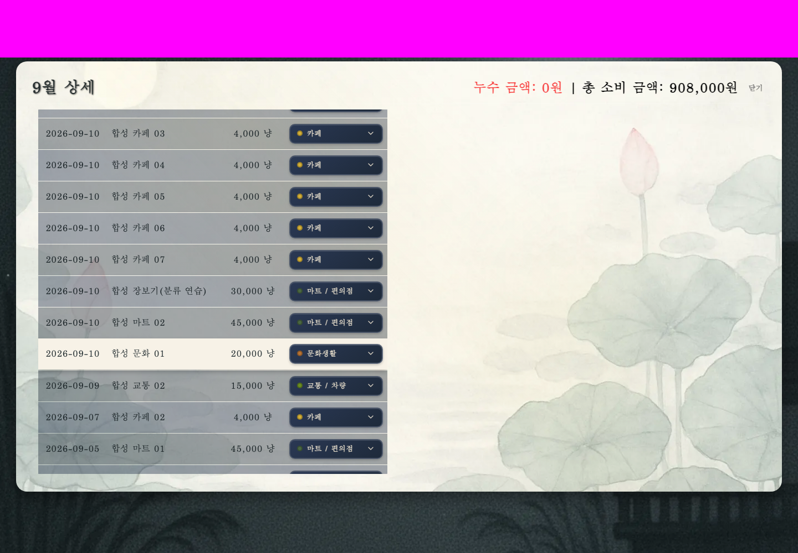
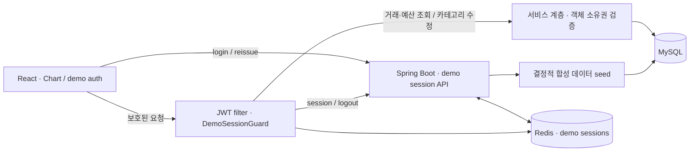

# MoneyToad · 돈꺼비

**소비 내역을 분류하고 예산 대비 지출의 ‘누수’를 살펴보는 소비 관리 서비스**

> SSAFY 팀 프로젝트로 개발한 MoneyToad를 기반으로, 프로젝트 종료 후 **2026년 개인 포트폴리오 작업으로 접근 통제·데모 인증·합성 데이터·검증 환경을 고도화한 저장소**입니다. 원래 팀의 기능과 디자인, 이후 개인 개선의 범위를 구분합니다.

## Live Demo

[돈꺼비 데모 체험하기](https://moneytoad-portfolio.pages.dev/)

무료 데모 환경 특성상 첫 접속 시 서버 준비에 시간이 걸릴 수 있습니다. 오래 걸리면 **“서버 다시 확인”** 버튼을 눌러 주세요. 새 체험·로그인은 자동으로 반복하지 않으며, 서버가 준비되면 체험 버튼을 직접 눌러 시작합니다.

[Live Demo](#live-demo) · [핵심 데모](#핵심-데모) · [아키텍처](#아키텍처) · [기여 범위](#기여-범위) · [검증 결과](#검증-결과) · [로컬 실행과 재현](#로컬-실행과-재현) · [제약과 후속 과제](#제약과-후속-과제)

## 서비스 소개

거래 목록만으로는 어떤 소비가 예산을 초과했는지, 분류를 바꿨을 때 집계가 어떻게 달라지는지 파악하기 어렵습니다. 돈꺼비는 거래·카테고리·예산을 연결하고, 지출을 장독대에서 새는 물에 빗대어 보여줍니다. 사용자는 월별 소비를 확인하고 거래의 카테고리를 수정하며 예산 대비 누수를 살펴볼 수 있습니다.

이번 개인 개선의 중심은 **실제 데이터 접근 문제를 재현해 수정하고, 기존 팀 인프라 없이 핵심 사용자 흐름을 검증 가능하게 만드는 것**입니다. 데모는 방문자별 합성 데이터를 실제 SQL DB에 저장하며 Spring Boot API로 조회·수정합니다.

## 핵심 데모

1. **체험하기** — SSAFY 로그인 없이 데모 세션을 만들고 방문자 전용 데이터를 준비합니다.
2. **Chart 조회** — 12개월의 합성 거래와 기준 예산을 살펴봅니다.
3. **거래 재분류** — 현재 시나리오 월의 연습 거래를 카페에서 ‘마트 / 편의점’으로 변경합니다. 실제 카테고리 PATCH와 후속 GET을 사용합니다.
4. **집계 확인** — 월 소비 **908,000원은 유지**되고, 누수는 **18,000원 → 0원**으로 바뀝니다. 연간 조회의 해당 월 누수 표시도 해제됩니다.
5. **복원과 종료** — 새로고침 후 세션과 수정 결과가 복원되는지 확인하고 로그아웃합니다.

방문자마다 합성 사용자 1명, 금융정보 없는 카드 1개, 거래 240건, 기준 예산 72건을 로그인 성공 전에 원자적으로 생성합니다. 12개월 총 소비는 9,990,000원입니다. **이 예산은 코드로 작성한 시나리오 값이며 AI 예측 결과가 아닙니다.**

| 재분류 전 · 누수 18,000원 | 재분류 후 · 누수 0원 |
| --- | --- |
|  |  |

위 이미지는 저장된 E2E 실행 화면입니다. 상단은 식별정보 보호를 위해 마스킹했으며, 테스트용 시스템 폰트 대체를 적용했습니다. [새로고침 후 화면](docs/portfolio/evidence/selected-7feaad9fd2bd-chart-restored.png) · [로그아웃 화면](docs/portfolio/evidence/selected-7feaad9fd2bd-logout.png) · [브라우저 검증 요약](docs/portfolio/evidence/demo-browser-e2e-summary.json)

## 아키텍처

아래는 개인 고도화로 구성한 **데모 모드**의 핵심 경로입니다.



- **데이터 경계:** 사용자 소유권을 확인한 뒤 예산·거래·카드 데이터를 처리합니다. 데모 로그인은 방문자별로 분리된 SQL 데이터를 만듭니다.
- **인증 경계:** 접근 토큰은 프런트엔드 메모리에, 갱신 토큰은 HttpOnly 쿠키에 둡니다. Redis 세션은 최대 1시간의 절대 만료를 가지며, 회전으로 수명이 늘어나지 않습니다. 갱신 토큰 재사용 시 세션을 폐기합니다.
- **외부 서비스 경계:** 기존 SSAFY OAuth 경로는 별도 모드로 보존합니다. 데모 Chart는 SSAFY와 AI를 호출하지 않습니다. `CsvClient`의 AI 주소는 명시적 설정으로 분리되어 있습니다.
- **검증 환경:** 핵심 브라우저 시나리오는 로컬 HTTPS의 동일 origin에서 실제 API로 프록시합니다. 로컬 HTTP 쿠키·CORS 계약은 별도 사례로 검증합니다.

구현과 제약의 상세 근거는 [아키텍처 노트](docs/portfolio/architecture-notes.md)에 있습니다.

### 기술 스택

| 영역 | 저장소 기준 구성 |
| --- | --- |
| Backend | Java 21, Spring Boot 3.5.5, Spring Security / OAuth2 Client, Spring Data JPA, JWT(JJWT), WebClient, springdoc OpenAPI |
| 데이터 | MySQL, Redis — 검증 환경은 MySQL 8.4, Redis 8.0.1 |
| Frontend | React 19.1, TypeScript 5.8, Vite 7.1, React Router 7, TanStack Query 5, Zustand 5, Axios, Recharts 3, Tailwind CSS 4 |
| 테스트·빌드 | JUnit / Spring Boot Test, Vitest / Testing Library, Playwright 1.63.0 / Chromium, ESLint, Gradle 8.14.3, Node 22 |

버전 근거: [BE build](be/build.gradle) · [FE manifest](fe/package.json) / [lockfile](fe/package-lock.json) · [검증 도구 버전](docs/portfolio/evidence/tool-versions.json)

## 기여 범위

### 원래 SSAFY 팀 프로젝트

[원본 MoneyToad](https://github.com/rladbstn1000/MoneyToad)의 검토 기준은 `c35d37e82d7273733d45100492b87f12d73fd92b`입니다. 다음 기능은 원래 팀 프로젝트에 존재했습니다.

- SSAFY OAuth, JWT 인증과 갱신 토큰 저장
- 거래·예산 API와 저장소 계층의 집계
- 카드·CSV·AI 연동 경로
- 프런트엔드 화면과 시각 디자인

이 항목들은 **팀 공동 성과**로 표기합니다. 당시 기능별 개인 담당 범위는 공개 자료만으로 확정하지 않으며, 커밋 작성자만을 근거로 단독 기여를 주장하지 않습니다.

### 2026년 프로젝트 종료 후 개인 고도화

| 해결한 문제 | 변경 내용 | 확인 방법 |
| --- | --- | --- |
| 객체 접근 통제 | 예산 소유권 검증과 카드 소유권을 확인하는 CSV 경계를 보강하고, 타인 소유·미존재 객체에 일반적인 404 계약 적용 | 소유자·타 사용자·미존재 객체의 응답과 DB 변경 여부 회귀 검증 |
| 외부 인프라 의존 | `CsvClient`의 AI 주소를 필수 설정으로 분리하고 demo/OAuth 프로필과 HTTP 경계를 명시 | 팀 서버 fallback 없이 설정·필터·쿠키·CORS 계약 검증 |
| 데모 인증 | 방문자별 Redis 세션, 토큰 회전·재사용 폐기·절대 만료, 메모리 기반 FE 인증과 복원·중복 갱신 조정 | 로그인·갱신·실패·로그아웃 및 단일 탭 경쟁 조건 검증 |
| 체험 데이터와 Chart 안전성 | 코드 기반 결정적 seed, API 기준월 사용, 샘플 fallback 데이터의 실제 수정 요청 전파 방지 | 방문자별 데이터 분리와 결정성, 실제 카테고리 수정 후 집계·복원 검증 |
| 프런트엔드 품질 | lint 부채 정리, OAuth/demo 모드별 타입·빌드·회귀 검증 구성 | FE 176개와 lint 오류·경고 0 |
| 재현 가능한 증거 | 전용 MySQL·Redis·Spring Boot·Chromium 검증, 외부 요청 탐지, 실행별 자원 정리와 공개 결과 정제 | 독립 E2E 2회, 현재 실행을 가리키는 종합 요약과 선별 화면 |

파일별 출처와 변경 경계는 [기여 구분](docs/portfolio/contribution-boundary.md) 및 [6단계 파일 manifest](docs/portfolio/final-manifest.md)에 기록되어 있습니다. 검토된 팀 baseline을 첫 커밋으로 가져왔으며 원래 팀 저장소의 Git 이력은 포함하지 않았습니다. 이후 5개 커밋에 개인 후속 작업을 나누고, README는 그 뒤의 별도 커밋으로 추가했습니다.

## 검증 결과

아래는 공개 소스 기준점 **`a750718033e51041015d5809b60c841d37e5c8ba`에 포함된 저장된 검증 결과**입니다. README 편집 과정에서 전체 테스트를 다시 실행한 결과로 표기하지 않습니다.

| 검증 | 기록된 결과 | 정제된 근거 |
| --- | --- | --- |
| Backend | **275 PASS**, 실패·오류·skip 0 | [BE 회귀 요약](docs/portfolio/evidence/be-regression-summary.json) |
| Frontend | **176 PASS** = OAuth 125 + demo 51, pending·todo 0 | [FE 회귀 요약](docs/portfolio/evidence/fe-regression-summary.json) |
| 타입·빌드·lint | 제품/테스트/E2E 타입, OAuth/demo 빌드 PASS, 잘못된 인증 모드 거절, **lint 0 errors / 0 warnings** | [FE 회귀 요약](docs/portfolio/evidence/fe-regression-summary.json) |
| 실제 Chromium E2E | **독립 2회 × 각 4개 사례 PASS**, workers 1, retries 0 | [E2E 종합 요약](docs/portfolio/evidence/demo-browser-e2e-summary.json) |
| 격리·정리 | 제품 API mock 없음, 외부 애플리케이션 요청 시도 0, 실행 자원 cleanup PASS | [개별 실행](docs/portfolio/evidence/browser-7feaad9fd2bd-summary.json) · [최종 자원 확인](docs/portfolio/evidence/final-resource-check.json) |

핵심 E2E는 실제 Spring Boot·JWT 필터·세션 가드·MySQL·Redis를 통과합니다. HTTPS `public-demo`에서 Chart 변경과 복원을 검증하고, HTTP `local-demo`의 쿠키·CORS 사례를 함께 실행합니다. 외부 요청 0은 **테스트용 폰트 대체와 외부 요청 감시가 적용된 검증 환경**의 결과입니다.

공개 근거에는 테스트 수·계약·정제된 화면만 담았습니다. 원문 토큰, HTTP dump, trace/HAR/video, 실행 식별값과 개인 로컬 경로는 포함하지 않습니다. [공개 검증 및 출력 정책](docs/portfolio/verification-summary.md) · [기준 스냅샷 공개 검사](docs/portfolio/evidence/snapshot-scan.json)

## 로컬 실행과 재현

아래는 초기 공개 스냅샷의 **실제 데모 앱·전용 DB·Redis·Chromium 자동 검증** 재현 절차입니다. 실행이 끝나면 서버도 종료됩니다. 최신 소스의 검증 절차는 [22단계 재현 안내](docs/deployment/22-cookie-e2e-time-basis.md#재현)를 참고하세요.

### 준비

- Java 21, Node 22와 npm, Python 3, `redis-server` / `redis-cli`, OpenSSL
- 로컬 Docker와 미리 준비한 `mysql:8.4` 이미지 — 실행기가 이미지를 자동으로 받지는 않습니다.
- `wrapper/`와 `caches/`를 포함하는 신뢰 가능한 별도 Gradle 의존성 캐시
- 아래 절차로 별도 설치하는 FE 의존성과 잠금 버전에 맞는 Playwright Chromium

현재 실행기는 **macOS Java 탐색과 로컬 Docker Unix 소켓**을 사용합니다. 다른 운영체제에서의 전체 실행은 검증하지 않았습니다. Gradle 캐시 인자는 원본 팀 프로젝트 checkout이 아니라 검증용 의존성 캐시를 가리켜야 합니다.

### 실행

공개 검사기는 Git metadata가 없는 스냅샷을 대상으로 합니다. 새 작업 폴더에 검증 표의 기준 커밋을 내보내면 검증 결과가 원래 checkout의 문서를 덮어쓰지 않습니다. 의존성·캐시·브라우저도 내보낸 소스 밖에 둡니다.

```sh
git clone https://github.com/rladbstn1000/MoneyToad-Portfolio.git
cd MoneyToad-Portfolio

MONEYTOAD_WORK="$(mktemp -d)"
mkdir -p "$MONEYTOAD_WORK/source" "$MONEYTOAD_WORK/dependencies"
git archive a750718033e51041015d5809b60c841d37e5c8ba | tar -x -C "$MONEYTOAD_WORK/source"
cd "$MONEYTOAD_WORK/source"

cp fe/package.json fe/package-lock.json "$MONEYTOAD_WORK/dependencies/"
npm ci --prefix "$MONEYTOAD_WORK/dependencies" \
  --ignore-scripts --no-audit --no-fund \
  --cache "$MONEYTOAD_WORK/npm-cache" --registry https://registry.npmjs.org

PLAYWRIGHT_BROWSERS_PATH="$MONEYTOAD_WORK/browsers" \
  "$MONEYTOAD_WORK/dependencies/node_modules/.bin/playwright" install chromium

# 아래 자리표시자를 미리 준비한 별도 Gradle 캐시의 절대 경로로 바꿉니다.
python3 -B scripts/verification/public_snapshot.py --phase all \
  --cache-seed "<verification-gradle-cache>" \
  --browser-path "$MONEYTOAD_WORK/browsers" \
  --dependencies "$MONEYTOAD_WORK/dependencies"

python3 -B scripts/verification/public_scan.py
```

실행기는 공유 DB·Redis나 기존 앱 환경파일을 재사용하지 않고 전용 로컬 자원을 구성합니다. 의존성 설치 단계와 애플리케이션 외부 요청 0 검증 단계는 별개입니다. 새 정제 결과는 내보낸 소스의 `docs/portfolio/evidence/`에 기록됩니다. 세부 조건은 [독립 검증 안내](docs/portfolio/verification-summary.md)와 [실행 진입점](scripts/verification/public_snapshot.py)을 참고하세요.

개발 서버를 별도로 구성할 때의 설정 계약은 [BE 환경 예제](be/.env.example)와 [FE 환경 예제](fe/.env.example)에 있습니다. BE 예제는 자동으로 읽히지 않으며, 데모 프로필·활성화·배포 종류와 전용 DB·Redis 및 새 서명 비밀값을 직접 제공해야 합니다. `JPA_DDL_AUTO=validate`는 준비된 스키마를 전제로 합니다. FE는 `VITE_AUTH_MODE=demo`를 명시해야 하고 생략하면 기존 OAuth 모드가 됩니다. 위 자동 검증 절차는 초기 공개 스냅샷 기준입니다.

## 제약과 후속 과제

- **Legacy SSAFY OAuth:** 원래 로그인·redirect 주소와 일반 모드 CORS 설정, 일부 인증 로그 부채가 남아 있습니다. 기존 OAuth 모드는 별도 설정 검토가 필요합니다.
- **AI:** 공개 AI adapter는 아직 제공하지 않습니다. 원래 AI 디렉터리·MinIO 설정·미확인 CSV는 이 저장소에서 제외했습니다. `AI_BASE_URL`은 클라이언트 생성에 필요하지만 데모 Chart는 AI를 호출하지 않으며, 검증에서는 관리하는 loopback 주소를 사용합니다.
- **폰트 자산:** 현재 제품은 시스템 폰트를 사용합니다. 위 저장된 초기 E2E 화면의 테스트용 폰트 대체와는 구분합니다.
- **세션과 데이터:** 로그아웃·세션 만료 뒤에도 합성 SQL 데이터는 남습니다. 현재는 데이터 수용 상한·수동 정리·최소 요청 제한을 적용하며, 자동 정리와 여러 탭 사이의 인증 조정은 후속 과제입니다.
- **운영 배포:** 공개 데모의 Chart 수정·새로고침 복원·로그아웃 흐름을 실제 Chromium으로 확인했습니다. 무료 환경의 상시 가용성을 보장하지 않으며, 팀 코드·시각 자산에 새로운 포괄 라이선스를 선언하지 않습니다.

상세 구분: [아키텍처와 외부 의존성](docs/portfolio/architecture-notes.md) · [외부 참조 검토](docs/portfolio/evidence/external-reference-review.json)

## 공개 문서 읽기

| 문서 | 확인할 내용 |
| --- | --- |
| [기여 구분](docs/portfolio/contribution-boundary.md) | 원래 팀 기능과 개인 후속 작업의 경계 |
| [아키텍처 노트](docs/portfolio/architecture-notes.md) | 합성 데이터, 인증, 외부 의존성과 남은 제약 |
| [독립 검증 안내](docs/portfolio/verification-summary.md) | 실행 전제와 공개 근거 정책 |
| [6단계 스냅샷 감사](docs/portfolio/16-public-commit-plan.md) | 단계별 검증·실패와 보완 이력 |
| [파일 manifest](docs/portfolio/final-manifest.md) | 6단계 기준 파일별 출처·포함·제외 결정 |

스냅샷 감사와 그 안의 readiness 값은 **Git 초기화 전 준비 당시의 기록**으로 보존합니다. 현재 저장소의 push 상태를 나타내는 값이 아닙니다. manifest와 저장된 검증 결과도 README 개편 전 6개 커밋의 기준 자료로 읽어야 합니다.
