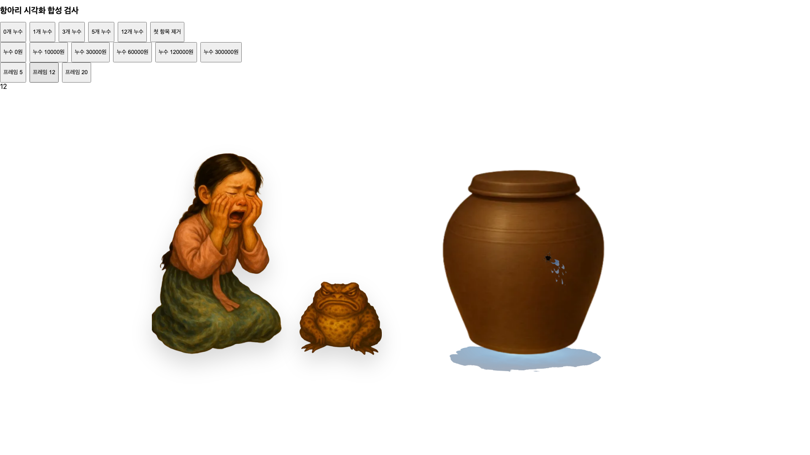
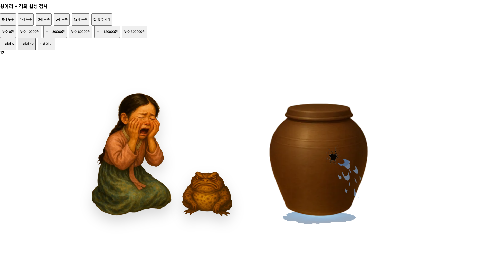
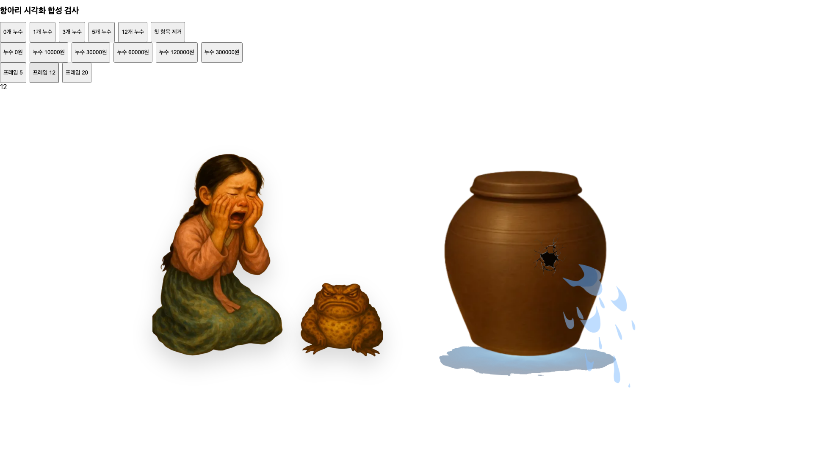

# 27 — 장독대 상대 비율·금액별 누수와 조언 2단 스크롤

2026-10-06. 25·26단계 미커밋 구현을 출발점으로 삼았으며 랜딩의 원본 비율·그림 위 텍스트, 즉시 시작하는 frontend-only 체험, 데이터 계산·초기화, 6개 페이지를 보존했다. 실제 공개 서비스에는 접속하거나 배포하지 않았다.

## 범위와 원본 비교 방법

비교 기준은 검토된 원본 `ade12429242ff3653f4050bec14ce373ac666832`의 CSS, SVG 좌표, 부모 레이아웃과 동일 이미지 자산이다. 원본 전체 앱을 과거 서버와 다시 실행한 결과는 아니다. 시스템 폰트·비활성 패널·동작하지 않는 탐색을 사용한 **시각적 재구성 fixture**와 실제 26단계 화면, 실제 수정 화면을 같은 viewport에서 비교했다. 원본 OAuth/API/애니메이션을 실행했다고 해석하지 않는다.

표시 높이는 이미지의 alpha >16 가시 영역을 CSS 픽셀로 변환해 구했다. SVG의 기본 `preserveAspectRatio="xMidYMid meet"`, viewBox 배율과 원본 투명 여백을 반영하고 drop-shadow는 제외했다. 콩쥐·두꺼비·항아리·종이 이미지의 원본/현재 파일 일치도 확인했다. 단순 CSS width 수치의 비교가 아니다.

## 장독대 상대 크기

모두 누수 상태이며 아래 세 비율의 분모는 가시 항아리 높이다.

| viewport / 단계 | 항아리 높이(px) | 콩쥐 / 항아리 | 두꺼비 / 항아리 | 두루마리 / 항아리 |
|---|---:|---:|---:|---:|
| 1920×1080 원본 재구성 | 505.18 | 1.086 | 0.398 | 1.363 |
| 1920×1080 26단계 실제 | 321.66 | 1.056 | 0.363 | 2.123 |
| 1920×1080 수정본 실제 | 494.03 | 1.091 | 0.399 | 1.380 |
| 1440×1000 원본 재구성 | 480.51 | 1.142 | 0.418 | 1.327 |
| 1440×1000 수정본 실제 | 362.38 | 1.080 | 0.395 | 1.411 |
| 3840×2160 원본 재구성 | 1072.56 | 0.512 | 0.187 | 0.679 |
| 3840×2160 수정본 실제 | 849.58 | 0.646 | 0.236 | 0.804 |

1920의 네 그림 가시 영역을 합친 bounding rectangle은 원본 재구성에서 viewport 폭96.45%·높이68.59%, 26단계에서71.06%·63.24%, 수정본에서96.15%·63.14%다. 그림이 칠해진 픽셀 면적이나 화면 점유율 전수 측정과는 다르다.

1920에서 26단계의 항아리·캐릭터가 두루마리에 비해 작아진 관계를 교정했다. 1440에서는 형상을 겹치지 않게 별도 열에 배치하므로 원본의 절대 크기를 그대로 재현하지 않는다. 3840에서도 원본의 무제한 가로 확장 대신 장면 폭 상한을 두므로 원본과 동일 픽셀/비율이라고 주장하지 않는다. 정상 상태도 별도로 측정했으며 1920의 수정본 콩쥐/항아리 1.072, 두꺼비/항아리 0.430으로 원본 재구성 1.068, 0.429에 가깝다.

왼쪽 캐릭터·가운데 항아리·오른쪽 두루마리는 실제 grid 공간을 사용한다. 두루마리 전체를 transform으로 축소하지 않고 기존 글자 크기·safe area·목록 내부 스크롤을 유지했다. 좁은 화면은 종이를 다음 행으로, 600px 이하는 항아리와 캐릭터도 다른 행으로 배치한다.

[원본·26단계 비교 측정](evidence/POT_PROPORTIONS_AND_ADVICE_SECTIONS/proportions-summary.json), [수정본 측정](evidence/POT_PROPORTIONS_AND_ADVICE_SECTIONS/current-ratios.json).

## 금액별 누수 표현

카테고리별 `spending - threshold`를 사용한다. 기존 category key 기반 anchor는 고정하며 다른 카테고리의 합계·배열 순서가 해당 구멍 크기를 바꾸지 않는다. 누수 0은 효과를 렌더링하지 않는다. 물웅덩이의 합계 기반 계산은 별개로 보존했다.

원본의 금액별 배율은 다음과 같다.

- 구멍: `max(0.4, min(1.5, 0.4 + leakAmount / 80000))`
- 물줄기: `max(0.2, min(2.0, 0.3 + leakAmount / 80000))`

| 초과금액 | 구멍 배율 | 물줄기 배율 |
|---:|---:|---:|
| 0 | 효과 없음 | 효과 없음 |
| 10,000 | 0.525 | 0.425 |
| 30,000 | 0.775 | 0.675 |
| 60,000 | 1.150 | 1.050 |
| 120,000 | 1.500 | 1.800 |
| 300,000 | 1.500 | 2.000 |

구멍은 88,000원, 물줄기는 136,000원부터 포화한다. 이 표는 계산값이며 실제 보이는 픽셀 크기와 동일하지 않다. 투명 여백, SVG 좌표 변환과 Lottie의 같은 구간 대표 프레임을 별도로 관측해야 한다.

26단계의 최대12개 검사에서 요구했던 “모든 장식 사각형 완전 분리”를 그대로 사용하면 실제 누수 구멍을 지나치게 축소하게 된다. 이번에는 장식 균열 선의 중첩을 허용하고 실제 어두운 구멍 중심 구분·몸통 내부·조작부와 주요 캐릭터 비가림을 검사한다. 고정 중심, 필터링 후 위치 안정성, 물 출발점 일치는 계속 요구한다. 해당 계약 교체를 최종 검사 근거와 함께 기록한다.

최대 물줄기는 기존 500×520 SVG의 경계를 실제로 넘어 잘렸다. demo 표현에서 출발점을 그대로 둔 채 좌우 물줄기를 대칭으로 25° 아래로 회전시키고, SVG 높이를700으로 늘렸다. 12개 모두 최대 크기인 대표 프레임5/12/20의 실제 가시 영역은 y≈662.4 이내였다. 이는 효과 배율을 줄이거나 overflow로 가리는 대신 물이 떨어지는 공간을 확보한 것이다. 항아리 폭·좌표는 유지하고 캐릭터 바닥 여백을 동일 y=480에 맞췄다. 두루마리는 일반 화면에서 상단, 2200px 이상에서 가운데 정렬해 글자 크기와 자연스러운 위치를 보존한다. OAuth의 기존 부모 높이·520 viewBox는 유지하며 공통 금액 곡선은 위 원본 기준을 사용한다.

카테고리별 비대칭 위치는 유지하되 최대 균열의 몸통 경계를 위해 경조사/회비 anchor 한 곳을 `(0.68,0.86)`에서 `(0.70,0.845)`로 조정했다. 조절·월 이동·다른 항목 제거 때는 움직이지 않는다. 모든 장식 사각형 완전 분리 대신 실제 어두운 중심의 구분과 몸통 내부를 검사하며, 주변 균열선·장식 물줄기의 중첩은 허용한다.

같은1920×1080 fixture, 카페 anchor, 프레임12의 측정이다. 균열은 원본565×442 중 alpha>16인335×397영역을 실제 표시 배율로 환산했다. 중앙의 검은 구멍과 주변 균열선을 포함한 **가시 균열 영역**이며 CSS 이미지 사각형을 불투명 구멍 크기로 부르지 않는다. 중앙 dark core만의 자동 분리는 NOT_MEASURED이고, 구분 가능성은 실제 화면과 보수적 중심 영역 검사로 함께 판단했다.

| 누수 | 가시 균열 폭×높이(px) | 가시 항아리 폭 대비 | 실제 물줄기 폭×높이(px) |
|---:|---:|---:|---:|
| 0 | 없음 | 0 | 없음 |
| 10,000 | 30.85×36.56 | 8.04% | 36.51×62.02 |
| 30,000 | 45.54×53.97 | 11.87% | 57.98×98.50 |
| 60,000 | 67.57×80.08 | 17.61% | 90.19×153.22 |
| 120,000 | 88.14×104.45 | 22.97% | 154.62×262.67 |
| 300,000 | 88.14×104.45 | 22.97% | 171.80×291.85 |

물줄기는 Lottie의 실제 mask가 적용된 SVG 프레임을 메모리 canvas에 그린 후 가시 픽셀을 live SVG 좌표계로 변환했다. 프레임5/12/20 모두 상한 전 증가·이후 비감소·동일 origin·경계 내 표시가 PASS다. 출발점은 모든 금액에서 SVG `(296.5,296.34714285714284)`로 동일하다. 모든 애니메이션 프레임을 전수 검사했다는 뜻은 아니다.

| 작은 누수10,000 | 중간 누수60,000 | 큰 누수300,000 |
|---|---|---|
|  |  |  |

[금액·프레임 관측](evidence/POT_PROPORTIONS_AND_ADVICE_SECTIONS/severity.json), [가시 균열 측정](evidence/POT_PROPORTIONS_AND_ADVICE_SECTIONS/crack-alpha.json), [최대12개 물줄기 범위](evidence/POT_PROPORTIONS_AND_ADVICE_SECTIONS/water-expanded-extents.json), [최대12개 화면](evidence/POT_PROPORTIONS_AND_ADVICE_SECTIONS/after-pot-12-anchors.png).

첫 실행의 path 관측기는 Lottie가 defs 안의 mask로 rect를 그린다는 점을 놓쳤다. 실제 경계 잘림도 별도로 확인해 위 표시 공간을 교정했다. 두 번째 관측은 회전한 bounding rectangle의 투명 모서리를 물로 계산해 실패했다. 이를 실제 가시 픽셀의 좌표 변환으로 수정했다. 두 실패 모두11 PASS/1 FAIL·정리 PASS로 보존하고, 최종12 PASS와 섞지 않았다. [교정 이력](evidence/POT_PROPORTIONS_AND_ADVICE_SECTIONS/iterations.json) 참조.


## 조언 첫 화면과 아래 상세

`Header`는 첫 섹션의 일반 문서 흐름에 있다. 별도의 고정 헤더 높이를 추정해 빼지 않고 첫 섹션에 `min-height:100dvh`를 적용했다. 제목·샘플 안내 아래 월 선택/요약이 놓이고 52px 이상의 상세 이동 버튼은 섹션 마지막에 배치된다. 고정 height나 overflow:hidden으로 콘텐츠를 잘라내지 않는다.

상세 요약·카드는 항상 바로 다음 DOM 섹션에 존재한다. 버튼 클릭 전 display:none, 조건부 mount, accordion을 사용하지 않는다. 두 번째 섹션에도 viewport 최소 높이가 있어 상세 제목까지 충분히 스크롤할 수 있다. 클릭/Enter/Space, wheel과 reduced-motion 경로, 빈 결과 이동, modal Escape와 원래 카드로의 focus 복귀를 유지했다.

26단계의 “모든 viewport에서 CTA가 첫 화면 안”이라는 조건은 모바일 콘텐츠를 압축하지 않는 새 요구에 맞춰 **desktop의 첫 화면 하단 CTA + mobile의 스크롤 접근 가능**으로 교체했다. 상세 카드 초기 가시성을 권장하는 판정은 사용하지 않는다. **DOM에는 이미 존재하되 초기 viewport 아래**에 있다는 조건을 추가했다.

| viewport | 첫 섹션 높이(px) | 상세 시작 y(px) | CTA 높이(px) | 이동 완료 제목 y(px) |
|---|---:|---:|---:|---:|
| 390×844 | 1048 | 1048 | 52 | 112 |
| 768×1024 | 1102 | 1102 | 52 | 112 |
| 1440×1000 | 1000 | 1000 | 56.5 | 112 |
| 1920×1080 | 1080 | 1080 | 56.5 | 112 |
| 2560×1440 | 1440 | 1440 | 56.5 | 112 |
| 3840×2160 | 2160 | 2160 | 56.5 | 112 |
| 1920×900 | 900 | 900 | 56.5 | 112 |

모든 초기 상세 카드가 viewport 아래에 있고 body 가로 overflow는0이다. 모바일은 첫 섹션을 넘겨 스크롤하면서 남은 월 선택/CTA를 본다. 7개 크기의 첫 화면과 이동 후 상세 screenshot을 직접 확인했다. smooth scroll의 완료는 요소 위치로 확인했으며 `getAnimations()`만으로 완료를 추정하지 않았다.

[조언 측정](evidence/POT_PROPORTIONS_AND_ADVICE_SECTIONS/advice-inspect.json) · [1920 첫 화면](evidence/POT_PROPORTIONS_AND_ADVICE_SECTIONS/after-1920-1080-advice.png) · [1920 상세](evidence/POT_PROPORTIONS_AND_ADVICE_SECTIONS/after-1920-1080-advice-detail.png) · [390 첫 화면](evidence/POT_PROPORTIONS_AND_ADVICE_SECTIONS/after-390-844-advice.png) · [390 상세](evidence/POT_PROPORTIONS_AND_ADVICE_SECTIONS/after-390-844-advice-detail.png)

## 로컬 검증 상태

FE 검사는 고정 임시 source와 기존 lockfile 의존성으로 실행했다. 실제 환경파일·서버 주소·클라우드 자격증명을 주입하지 않았다.

| 검사 | 결과 |
|---|---|
| OAuth FE | 252 PASS |
| remote demo FE | 245 PASS |
| local demo FE | 55 PASS |
| FE 합계 | 552 PASS; fail/skip/todo0 |
| 제품·테스트·E2E·Functions TypeScript | PASS |
| OAuth/remote demo/local demo build | PASS |
| invalid mode 5개 | PASS |
| lint | 0 errors / 0 warnings |
| 결정적 scenario 생성 | PASS |
| FE 검증 소유 자원 정리/입력 source 보존 | PASS |
| 최종 Chromium | 12/12 PASS, 실패/skip/global errors0·exit0·소유 자원 정리 PASS |
| 최종 strict scanner·링크 | PASS — 미해결0, 새 링크27개 정상; 규칙/분류 변경0 |

[FE 결과](evidence/POT_PROPORTIONS_AND_ADVICE_SECTIONS/fe-summary.json). 브라우저 실패 실행과 교정 이유는 최종 실행과 구분해 보존한다. 제품 BE·인증·gateway·provider·DB·Redis·seed를 변경하지 않았으므로 BE/원격 공급자 검증을 반복하지 않았다. 실제 서버 기능을 이번 static 브라우저 검사로 새로 검증했다고 표현하지 않는다.

## 한계와 최종 판정

원본은 재구성 기준이고, 사용자 모니터의 실제 OS 배율·브라우저 zoom은 측정하지 않았다. screenshot/CSS viewport 검사 PASS와 사용자 시각 승인은 별개다. 현재 공개 제품과 frontend-only 수정본은 다른 상태이며 공개 접속·배포·commit·push를 수행하지 않았다.

최종 로컬 판정:

```text
POT_PROPORTIONS_LOCAL_READY=true
LEAK_SEVERITY_VISUAL_LOCAL_READY=true
ADVICE_TWO_SECTION_LOCAL_READY=true
USER_VISUAL_APPROVAL=PENDING
FRONTEND_ONLY_DEMO_PUBLIC_READY=false
CURRENT_PUBLIC_DEPLOYMENT_UNCHANGED=true
```

최종 source·미리보기 bytes 일치, 실제 금액별 관측, scanner와 소유 검증 자원 정리가 모두 PASS다. 사용자용 미리보기만 의도적으로 실행 중이다.

## 최종 소스·미리보기

제품 수정은 LeakPotPage의 표현·CSS, potLeakAnchors, ToadAdvice의 표현·CSS 5개 모듈이다. 관련 테스트6개와 기존 검증 runner1개를 갱신했다. [변경 범위](evidence/POT_PROPORTIONS_AND_ADVICE_SECTIONS/implementation-delta.json), [보존 검사](evidence/POT_PROPORTIONS_AND_ADVICE_SECTIONS/preservation.json), [공개 검사](evidence/POT_PROPORTIONS_AND_ADVICE_SECTIONS/scanner.json), [링크](evidence/POT_PROPORTIONS_AND_ADVICE_SECTIONS/links.json)를 함께 저장한다.

최종 FE217개 파일과 일치하는 별도 사본으로 새 미리보기 [http://127.0.0.1:62002/](http://127.0.0.1:62002/)를 실행했다. 실제 UI로 마당→명시적 체험→장독대→조언→상세를 확인했고 API/auth/readiness/외부 요청0이다. 사용자용 서버만 의도적으로 유지하고 개발용 서버·검증 브라우저는 종료했다. 기존 다른 미리보기는 종료하지 않았다. [미리보기 일치·접속 검사](evidence/POT_PROPORTIONS_AND_ADVICE_SECTIONS/preview.json).

실행 명령은 FE의 `npm run dev:demo-local`이다. 별도 소유 loopback 포트·strictPort로 띄웠다. 종료를 요청하면 해당 소유 서버만 정리한다. 저장소에 환경파일·생성물·의존성을 추가하지 않았다.

[원본 재구성](evidence/POT_PROPORTIONS_AND_ADVICE_SECTIONS/original-reconstruction-1920.png) · [26단계](evidence/POT_PROPORTIONS_AND_ADVICE_SECTIONS/before-1920-pot.png) · [수정본1920](evidence/POT_PROPORTIONS_AND_ADVICE_SECTIONS/after-1920-pot.png) · [수정본390](evidence/POT_PROPORTIONS_AND_ADVICE_SECTIONS/after-390-pot.png).

기존 `local_demo_checks.py --phase fe`와 `--phase browser`에 확인한 설치 의존성·새 output 디렉터리·설치된 Chromium 경로를 명시했다. `.env` 로딩을 차단한 임시 source/build·소유 loopback만 사용한다. 실제 provider·공개 URL·BE 실행0이다. 공개 검사는 기존 `public_scan.scan()`으로 새 결과 경로에만 저장하며 scanner 규칙·분류를 변경하지 않았다.
