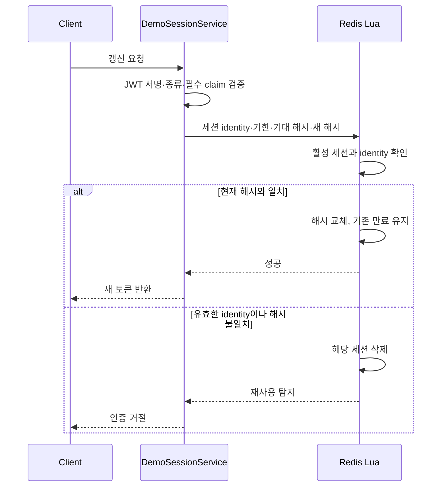

# 백엔드 문제 해결 사례

이 문서는 원래 팀 프로젝트에서 맡은 백엔드 구현과 프로젝트 종료 후의 개선을 구분한다. 현재 공개 체험판은 정적 프런트엔드이며, 아래 인증·SQL·Redis 사례는 저장소에 보존한 서버 코드의 설명이다.

## 1. 예산 수정에 객체 소유권 조건 추가

### 문제

원본 서비스는 요청 사용자의 존재를 확인한 뒤 예산을 예산 ID만으로 조회했다. 사용자가 존재한다는 사실만으로 그 예산의 소유권까지 확인되는 것은 아니다.

### 변경

수정 대상을 `findByIdAndUser_Id(budgetId, userId)`로 조회한다. 사용자 ID는 인증 경로에서 받은 값을 사용하고, 소유하지 않은 예산과 존재하지 않는 예산은 같은 일반적인 404 응답으로 처리한다.

[서비스 코드](../../be/src/main/java/com/potg/don/budget/service/BudgetService.java) · [저장소](../../be/src/main/java/com/potg/don/budget/repository/BudgetRepository.java)

### 검증에서 중요하게 본 것

[BudgetOwnershipIntegrationTest](../../be/src/test/java/com/potg/don/budget/BudgetOwnershipIntegrationTest.java)는 실제 보안 필터와 전용 MySQL을 사용한다. 요청 전후 별도 JDBC 조회로 예산 행을 비교한다.

- 소유자의 정상 수정은 허용하고 허용된 변경 필드만 바뀌는지 확인한다.
- 타 사용자·미존재 예산은 같은 404 응답과 모든 예산 행의 불변성을 확인한다.
- 토큰 없는 요청은 필터에서 401로 거절하고 DB가 바뀌지 않는지 확인한다.

이는 본인이 담당했던 백엔드의 누락을 후속 점검에서 보완한 사례다. 몇 줄을 바꿨는지가 아니라, 인증과 객체 권한을 구분하고 거절 시 부작용을 검증한 점이 핵심이다. [초기 BE 실행 근거](evidence/be-regression-summary.json)

## 2. 서버 연동 demo의 원자적 RT 회전과 세션 폐기

### 원본과의 차이

원본에도 Redis의 RT와 입력을 비교한 뒤 새 토큰을 발급하고 저장값을 교체하는 흐름이 있었다. 후속 demo 개선은 토큰 회전의 최초 도입이 아니라, 동시 요청과 재사용·만료 계약을 보강한 것이다. 일반 OAuth의 저장 경로와 demo의 세션 경로는 분리돼 있다.

### 처리 흐름

세션에는 RT 원문 대신 SHA-256 해시를 보관한다. Lua 안에서 현재 값 확인과 교체를 수행하며, 회전 중 만료를 새로 설정하지 않는다. 잘못된 토큰이나 다른 identity를 재사용으로 간주해 임의의 세션을 지우지 않는다.

[DemoSessionService](../../be/src/main/java/com/potg/don/auth/demo/DemoSessionService.java) · [회전 Lua](../../be/src/main/resources/redis/demo-session-rotate.lua) · [DemoSessionGuard](../../be/src/main/java/com/potg/don/auth/demo/DemoSessionGuard.java) · [Redis 회귀](../../be/src/test/java/com/potg/don/auth/demo/DemoSessionStoreRedisTest.java)

### 선택한 제약

동일 RT를 동시에 교환하면 최대 한 번 성공할 수 있지만, 뒤따른 재사용 탐지로 세션 전체가 폐기되어 먼저 받은 새 토큰도 무효가 될 수 있다. 정상 중복 요청도 재로그인이 필요할 수 있는 엄격한 정책이다. 무중단 멀티탭 처리를 보장하는 구현으로 소개하지 않는다.

세션 가드는 보호 요청마다 활성 세션을 확인한다. 삭제·만료 후 기존 AT를 거절하고 Redis 장애 시 인증을 성공으로 추정하지 않는다. 이 계약은 서버 연동 모드의 것이며 현재 정적 체험의 API 호출을 뜻하지 않는다. [서버 공개 검증](../deployment/public-full-experience-verified.md)

## 3. 사용자·기간 기준 월별·카테고리별 집계

### 요구

월별 총소비, 카테고리별 소비, 기준 예산과의 차이를 같은 거래 집합에서 일관되게 제공해야 한다. 사용자의 거래와 조회 기간을 먼저 제한하는 것이 기준이다.

### 구현

[TransactionRepository](../../be/src/main/java/com/potg/don/transaction/repository/TransactionRepository.java)는 사용자 관계와 기간 조건을 사용하고, 월별·카테고리별 `SUM`과 `GROUP BY` 결과를 projection으로 반환한다. 거래 기간은 시작 포함·종료 제외 구간으로 조회한다. 카드별 집계에서는 호출 경로의 소유권 확인과 함께 허용 카테고리 필터를 사용한다.

예산 조회·매핑은 [BudgetService](../../be/src/main/java/com/potg/don/budget/service/BudgetService.java), 거래 흐름은 [transaction 패키지](../../be/src/main/java/com/potg/don/transaction)에서 확인할 수 있다. 월별 예산 레코드와 거래 timestamp는 서로 다른 날짜 경계를 사용하므로 하나의 형식으로 뭉뚱그리지 않는다.

### 결과와 측정 범위

서버 연동 공개 여정에서는 예산을 바꾸고 거래를 재분류한 뒤 실제 재조회 결과를 확인했다. 기준월 총소비 908,000원은 유지되고 누수는 18,000원에서 0원, 연간 누수 표시도 갱신됐다. [당시 결과](../deployment/public-full-experience-verified.md)

이 수치는 합성 시나리오의 정합성 검증이다. 별도의 성능 측정 없이 응답 속도나 처리량 개선 배수를 주장하지 않는다. 현재 정적 체험도 같은 시나리오를 사용하지만 계산 위치는 브라우저 메모리다.

## 역할·결과를 함께 읽기

[기여 범위](contribution-boundary.md) · [검증의 시점과 환경](verification-index.md) · [정적 체험 전환 결정](demo-decision.md)
